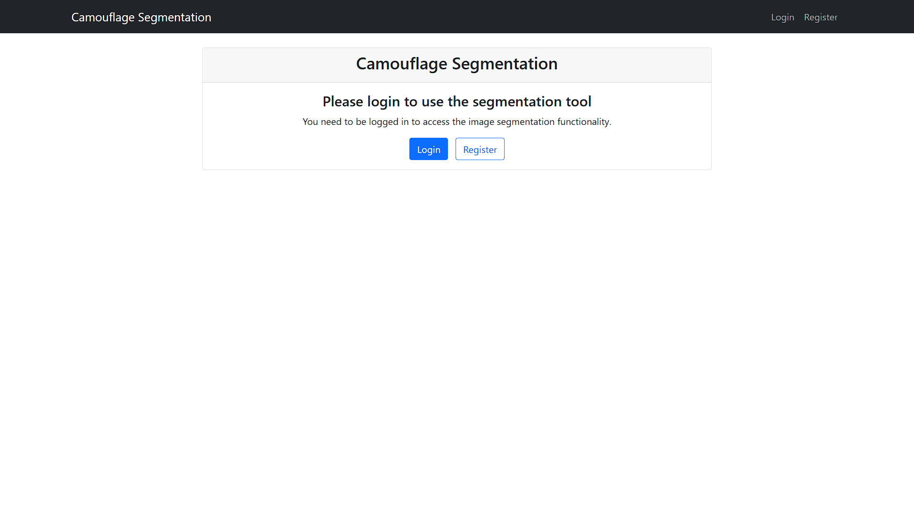
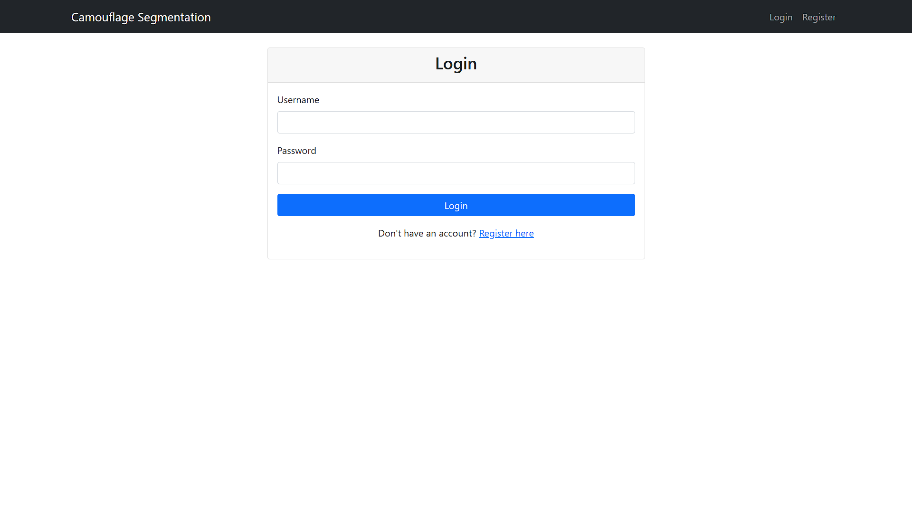
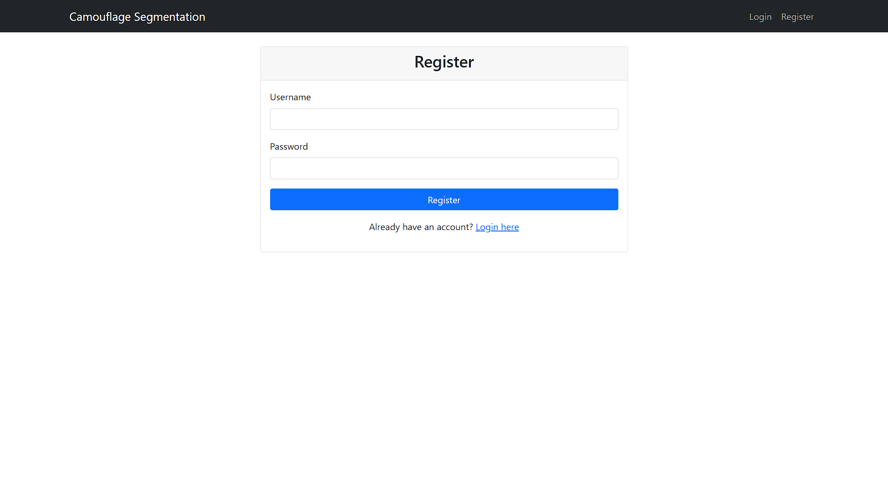
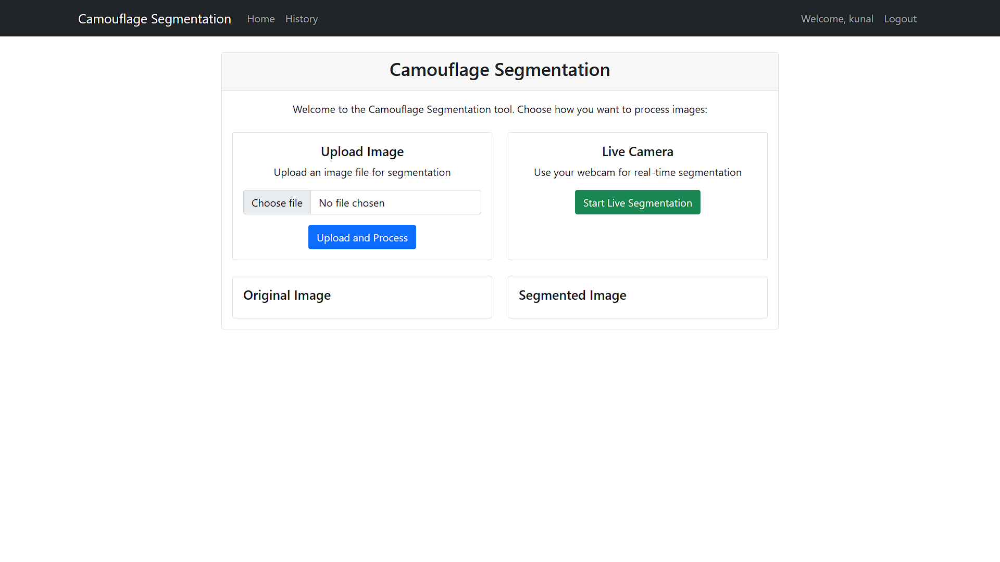
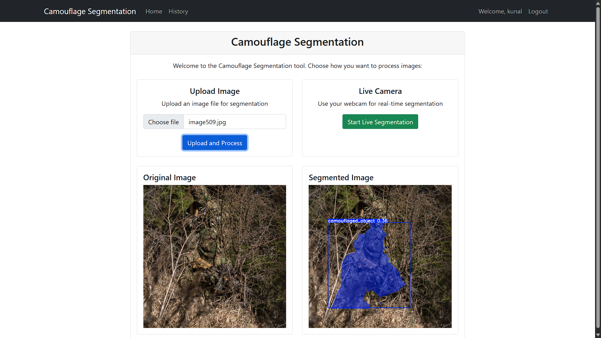
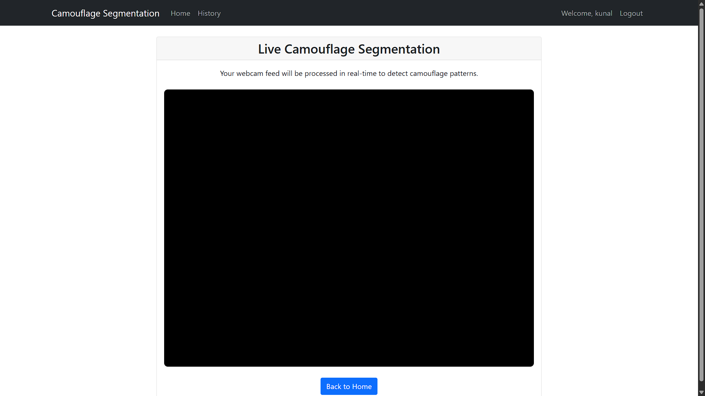
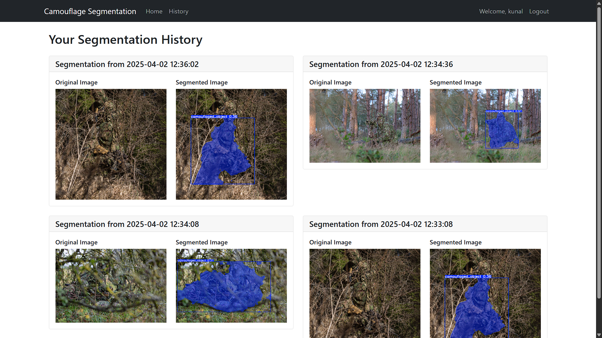

# 🥎 Camouflage Segmentation Project


This project uses a conda environment for dependency management. It is primarily trained to predict **camouflaged soldiers** using the **ACD1K dataset** and the **YOLOv8 segmentation model**.

Follow the steps below to set up and run the project.

## 📦 Prerequisites

- Anaconda or Miniconda installed on your system
- Python 3.8 or higher

---

## ⚙️ Setup Instructions

1. Clone the repository:

```bash
git clone https://github.com/mrYassh/CODS
cd camouflage-segmentation-project-master
```

2. Create and activate the conda environment using the provided environment.yml file:

```bash
conda env create -f environment.yml
conda activate camouflage
```

---

## 🚀 Running the Application

1. Make sure you're in the project directory and the conda environment is activated:

```bash
conda activate camouflage
```

2. Run the application:

```bash
python app.py
```

---

## 🧹 Environment Details

The project uses the following key dependencies:

- Python 3.8.20  
- PyTorch 2.4.1  
- OpenCV 4.11.0.86  
- Flask 2.0.1  
- Other dependencies as specified in `environment.yml`

---

## 🎮 Walkthrough Video

> A complete walkthrough is available inside the project directory:

📁 **[walkthrough.mp4](walkthrough.mp4)**

The video covers:

- Project overview and features
- Environment setup
- Running the application
- Using the interface
- Common use cases and examples

---

## 📸 Screenshots

### ↺ Choose Login/Register


### 🔐 Login Page


### 📝 Register Page


### 💥 Dashboard


### 🧐 Image Segmentation Result


### 📷 Live Camera View


### 🕓 History View


---

## 🚫 Ignored Files

This repo uses a `.gitignore` file to exclude large or sensitive data:

```
dataset/

```

---

## 🛠️ Troubleshooting

If you encounter any issues:

1. Ensure all dependencies are properly installed by running `conda list`
2. Try recreating the environment if you face dependency conflicts
3. Make sure you're using the correct Python version (3.8.20)

---

👨‍💻 Developed By

Yash Dipke , Yash Channawar , Kunalsingh Bias , Ishan Jaiswal , Nikhil Khawase

Happy segmenting! 🧪✨

